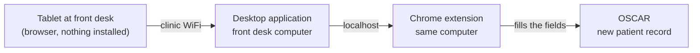
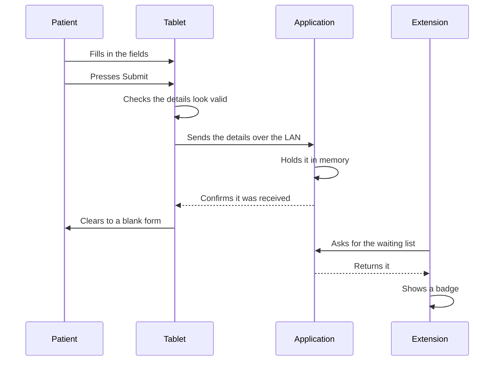
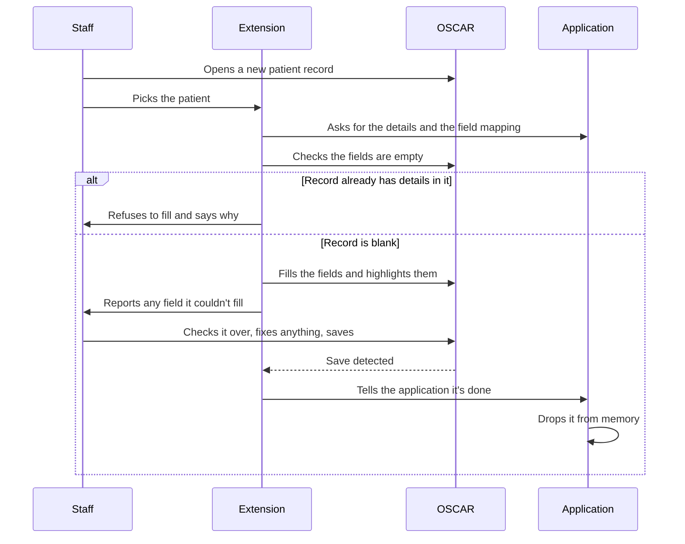

# asmart-autofill — Design

## Contents

- [Overview](#overview)
- [Tech Stack](#tech-stack)
- [Functional Requirements](#functional-requirements)
- [Non-Functional Requirements](#non-functional-requirements)
- [Diagrams](#diagrams)
- [Local API](#local-api)
- [Data](#data)
- [Distribution](#distribution)
- [Trade-offs](#trade-offs)
- [Pricing](#pricing)
- [Future Considerations](#future-considerations)

## Overview

Patients see multiple columns to be filled out for registration, which is confusing to them. After that, the staff verifies it and adds it to the EMR demographic.

This replaces that with a form on a tablet at the front desk. The patient fills in a simplified form (13 fields) and submits. The details land on the front desk computer, where the staff member opens a new patient record in OSCAR, clicks once to fill it in, checks it over, and saves.

**Goals**

- Give patients a simple form to fill in themselves.
- Cut the typing staff have to do, so registration is faster and has fewer mistakes.

**Not in v1**

- Any EMR other than OSCAR.

**Who it's for:** clinics. They install it on the front desk computer and use it daily.

### No server

The tablet and the computer are ten metres apart on the same WiFi. Patient details never need to leave the building, so nothing here goes to the internet.

A desktop application on the front desk computer is the whole product and the source of truth. It serves the form to the tablet, receives the submission, holds it, and hands it to the browser extension that fills OSCAR. There is no cloud service, no database, and no account to sign into.

The application exists because neither a browser tab nor a Chrome extension can accept an incoming connection — both can only make outgoing ones. For the tablet to send anything to the computer, something on that computer has to be listening at an address. That is the application's job.

The only things that reach the internet are the update feed and error reporting.

## Tech Stack

| Part | Choice |
|---|---|
| Desktop application | Tauri |
| Backend / Application core | Rust — the HTTP server and the in-memory queue |
| Frontend / Patient form, tray window | React + TypeScript |
| Chrome Extension | TypeScript, Manifest V3 |
| Storage | None — submissions are held in memory |
| Transport | HTTP over the clinic LAN |
| Updates | Tauri's updater |

## Functional Requirements

### The fields collected

- First name
- Last name
- Preferred name
- Address
- City
- Province
- Postal code
- Phone number
- Email
- Date of birth
- Health insurance number
- Health insurance version
- HC type

### Setting up

1. The clinic installs the application on the front desk computer. It starts with Windows and sits in the system tray.
2. On start, it picks up the computer's address on the clinic WiFi and listens there.
3. The tray window shows a QR code containing that address and a pairing token. Staff scan it once on the tablet, which opens the form.
4. If the computer's address changes — a reboot, a new lease — the QR shows the new one. Staff rescan. Nothing else is configured.
5. The extension is installed in Chrome on the same computer. It has no settings; everything it needs it asks the application for.

### Patient filling in the form

6. The patient opens the form on the tablet and fills in the fields.
7. The form checks the details look valid before it will submit.
8. On submit, the details are sent to the application and held as waiting to be entered.
9. The tablet clears itself and shows a blank form for the next patient.
10. Pressing submit twice doesn't create two entries.
11. If the application isn't running or the computer is asleep, the tablet says the front desk isn't reachable rather than failing silently.

### Staff entering it into OSCAR

12. The extension shows the patients waiting to be entered, newest first.
13. The staff member opens a new patient record in OSCAR and picks the patient from the list.
14. Clicking fill puts the details into the OSCAR fields and highlights what it filled.
15. If the record already has details in it, it refuses to fill and says so.
16. If any field couldn't be filled, it says which ones rather than failing quietly.
17. The staff member checks everything, corrects anything wrong directly in OSCAR, and saves.

### After it's entered

18. When the staff member saves in OSCAR, the extension tells the application, which drops the submission from memory.
19. Anything not entered within 2 hours is dropped automatically.
20. Closing the application, or restarting the computer, drops everything waiting.

## Non-Functional Requirements

| What | Target |
|---|---|
| Tablets per clinic | 1 |
| Registrations per clinic per day | 40–50 |
| Submissions waiting at once | 1 |
| Patient submits → appears in the extension | Under 1 second |
| Any local request | Under 50ms |

Everything here happens on one machine over a local network, so the numbers are not a constraint on the design. A hundred clinics is a hundred independent copies that never meet.

### Getting new submissions to the extension

The extension asks the application for the waiting list once a second. On localhost that costs nothing, and it removes every failure mode a pushed connection has — no reconnection logic, no connection held open in a tab, no fallback path.

## Diagrams

### The whole thing

Three parts, all inside the clinic.



### A patient submits



### Staff enters it into OSCAR



## Local API

Everything the application serves. It listens on one port on two addresses: the LAN address for the tablet, and localhost for the extension.

### For the tablet

| Endpoint | What it does |
|---|---|
| `GET /api/link` | The form. Requires the pairing token from the QR code. |
| `POST /api/submissions` | The patient's submitted details. |
| `GET /api/health` | Lets the tablet tell "front desk is asleep" from "form is broken". |

The details are sent in the request body, never in the address bar. Requests without a valid pairing token are refused, so a stranger who guesses the address gets nothing.

```
POST /api/submissions
{
  "first_name": "Jane", "last_name": "Doe", "preferred_name": "Janie",
  "address": "12 King St W", "city": "Toronto",
  "province": "ON", "postal_code": "M5H 1A1",
  "phone": "4165551234", "email": "jane@example.com",
  "date_of_birth": "1985-04-17",
  "health_insurance_number": "1234567890",
  "health_insurance_version": "AB",
  "hc_type": "ON"
}

201 Created
{ "id": "a3f9" }
```

### For the extension

| Endpoint | What it does |
|---|---|
| `GET /api/pending` | The list of patients waiting. Names and times only. |
| `GET /api/pending/{id}` | The full details for one patient, for filling in. |
| `POST /api/pending/{id}/filled` | Staff saved it in OSCAR. Drops it from memory. |
| `GET /api/mapping` | Which OSCAR field each value goes into. |

These are served on localhost only, and the application checks the request came from the extension's own origin so another page on the machine can't read the queue.

```
GET /api/pending

200 OK
[ { "id": "a3f9", "name": "Jane Doe", "submitted_at": "2026-08-13T14:12:04Z" } ]
```

### Responses

| Code | When |
|---|---|
| `200` / `201` | Success. |
| `400` | Details failed validation. |
| `401` | Missing or wrong pairing token. |
| `404` | No such submission — already entered, or expired. |
| `409` | That submission was already marked entered. |
| `429` | Too many submissions too quickly. |

## Data

Nothing is written to disk. A submission is a record in memory that lives from the moment the patient presses submit to the moment staff saves in OSCAR — usually a minute or two.

| Field | Notes |
|---|---|
| `id` | Generated on receipt. |
| `details` | The 13 fields. |
| `submitted_at` | When the patient pressed Submit. |

It leaves memory when staff marks it filled, when two hours pass, or when the application stops. There is no database to back up, no history to protect, and no copy of a health card number anywhere on disk.

### The OSCAR field mapping

Which OSCAR box each field goes into lives in a JSON file next to the application, which the extension fetches when it fills:

```json
{
  "emr": "oscar",
  "version": 1,
  "fields": {
    "first_name": "#firstName",
    "last_name":  "#lastName",
    "address":    "#address",
    "city":       "#city",
    "postal":     "#postal"
  },
  "save_button": "form[name=addDemographic]"
}
```

It sits with the application rather than inside the extension on purpose. The application updates itself in minutes; a Chrome extension waits days for Web Store review. Keeping the mapping on the application side means a broken selector — the most likely thing to break in this whole system, since OSCAR changes and nobody tells you — is fixed on your schedule. It also keeps the extension a thin pipe that rarely needs republishing, and makes another EMR another file rather than a code change.

## Trade-offs

### 1. A desktop application rather than a cloud service

Patient details never leave the clinic, which removes the data residency question, the breach surface, and the processor agreements that come with holding health data on someone else's machine. 

**The cost:** is that you have software installed on a hundred different Windows machines instead of one server you control, and you are blind to what happens on them beyond what error reporting tells you.

### 2. Held in memory rather than a database

The data lives about ninety seconds. A database would mean health card numbers on disk, a file to back up, and a file to protect, all to survive a crash during a window where the patient is still standing at the desk and can be asked again.

**The cost:** restart the computer with three patients waiting and those three fill the form again.

### 3. Polling rather than pushing

**Chosen:** the extension asks once a second.

Over localhost this is free, and it deletes the reconnection logic, the connection held open in the OSCAR tab, and the fallback path that a pushed connection needs. The delay is under a second, which nobody notices.

### 4. The mapping lives with the application, not the extension

**Chosen:** the extension fetches the OSCAR selectors from the application at fill time.

The application updates on your schedule; the extension waits on Chrome's review queue. Putting the part most likely to break on the side you can fix quickly is the difference between a broken clinic waiting minutes and waiting a week.

### 5. HTTP for now

**Chosen:** the tablet talks to the application unencrypted.

WiFi already encrypts traffic between a device and the router, and this is a closed clinic network. The residual risk is a device already on that network reading a submission in flight. Nothing is built for this in v1; see Future Considerations.

**When this changes:** before selling to any clinic that asks how the data is protected in transit, which will happen.

### 6. Rust in the core, React everywhere else

**Chosen:** Tauri, with the HTTP server and queue in Rust and everything visible in React.

The application has to accept an incoming connection, and no webview can. Something native has to hold the port, and in Tauri that something is Rust — there is no alternative inside the framework.

The alternative was bundling a Node runtime as a sidecar to keep the whole project in TypeScript. That costs about 50MB of install, a second process to supervise, and gives up the reason to use Tauri at all.

**Why the cost is acceptable:** the Rust is one file that stops changing once the routes work. The parts that change often — the form, the tray window, the field mapping, the extension — are all TypeScript or JSON.

### 7. QR code for discovery

**Chosen:** the application shows a QR with its current address, staff scan it on the tablet.

The alternatives are a fixed address on the computer, which makes the clinic's network someone's problem, or announcing itself over the network, which some networks block. A QR works everywhere and needs nobody to understand what an IP address is. The cost is a rescan on the rare occasions the address changes.

## Pricing

| What | Cost |
|---|---|
| Servers | $0 |
| Database | $0 |
| EV code signing certificate | ~$300–500/year |
| Chrome Web Store, one-time | $7 |
| Domain, for the update feed and site | ~$20/year |
| Static hosting for the update feed | ~$0 |

## Future Considerations

### 1. Encrypted transfer between tablet and desktop

The open item from v1. Three ways, in order of how much they cost to build:

- **HTTPS with a certificate the application generates itself.** Real encryption. The tablet shows a "connection is not private" warning that staff accept once during setup, because the certificate isn't from an authority the tablet recognises.
- **Encrypt the fields inside the form** using a key carried in the pairing QR. No warning on the tablet, about thirty lines using the browser's own crypto. Protects against a device snooping on the network, but not one actively tampering with it, since the form itself still arrives unencrypted.
- **A trusted certificate for a local address**, which is possible but involves owning a domain and renewing certificates for machines that may be offline.

The first is what comparable local-transfer tools do and is the likely answer.

### 2. Custom mapping

The form stays exactly as it is. What changes is that the clinic can say where each field should land in their own EMR, instead of waiting for a mapping to be written for them. This is what makes the product work with an EMR that hasn't been seen before, without a code change or a release.

### 3. macOS

Windows first. macOS needs an Apple developer account, notarization, and its own testing pass.

### 4. A native tablet app instead of the browser

**What this would replace:** the QR code, and the desktop having to work out its own address.

A machine does not have one IP address — it has one per network interface. A typical Windows PC carries loopback, the real WiFi adapter, several virtual copies of the WiFi card that Windows creates for hotspot and casting, and often a VPN adapter. Only one of those is reachable from a tablet on the clinic WiFi. Today the desktop picks it by scoring adapters (`net.rs`): not loopback, not a `169.254` placeholder, has a gateway, prefer wireless. That is the standard heuristic and it is right on an ordinary clinic PC, but it is still an inference — a VPN holding the default route is the case most likely to defeat it.

**How local-transfer applications normally avoid the question.** LocalSend, KDE Connect, Syncthing and similar tools do not guess. One side broadcasts a small packet to the local network — "I am here, this is my name and port" — and the other side hears it. The packet arrives carrying its own return address, and that address is proven reachable by the fact that the packet arrived at all. No scoring, no heuristic. mDNS/Bonjour is the same idea with a name attached, which is how printers and Chromecast are found.

**Why v1 cannot use it.** Discovery needs software on both ends. The tablet runs a plain browser, and a browser cannot listen for broadcasts — it can only open a URL it has been handed. So the address must be decided before anything reaches the tablet, with no help from the tablet. This is a direct consequence of the browser-based design, not an oversight.

**What a native app changes.** With an app on the tablet, the desktop stops advertising an address and starts announcing itself. The tablet finds it, and the address problem disappears rather than being solved. It also brings offline capture, a stored pairing instead of a bookmarked URL, and a real place to put encryption without the certificate warning described in item 1.

**What it costs.** An Android and an iOS build, two store accounts and two review processes, a release cycle that no longer moves at the speed of the desktop application, and a pairing flow that has to be designed rather than inherited from a URL. It also gives up the single largest advantage of the current design: a tablet needs nothing installed, so any device with a camera and a browser works, including a personal phone.

**When to revisit.** If address detection causes trouble on real installs, or if a clinic asks for offline capture. Until then the QR is the cheaper answer. A smaller step in the same direction is listing every candidate address in the tray window so staff can switch when the automatic choice is wrong — that covers the same failure without a mobile app.

### 5. Log retention by importance, not by age

**Where this stands today.** Logging rolls to a new file each day and keeps every one of them. Nothing prunes. A machine that has run for a year holds a year of files, the oldest still describing what happened on day one.

**The obvious fix, and why it is not the one wanted.** `tracing-appender` takes a `max_log_files` cap: on each rotation the oldest file is deleted. One argument, no moving parts. But it discards by age alone, so a genuine startup failure from three weeks ago is thrown away at exactly the same moment as three weeks of routine "listening on 0.0.0.0" lines. The information worth keeping is the rarest, and an age cap is blind to that.

**The intended approach.** A scheduled cleanup that prunes by importance instead: drop the routine entries once they are past their useful window, keep errors, warnings, startup failures, and address changes for much longer. Recent days stay complete for debugging a complaint from last week; older days shrink to only the lines that would ever be read again.

**What it costs.** More machinery than a cap. Something has to run on a schedule, parse each line to classify it, and rewrite files that the running application may hold open — which is the part that needs care on Windows, where an open file cannot always be replaced. Deciding which levels survive is a policy that has to be written down, and getting it wrong deletes the evidence for a bug rather than the noise around it.

**Why it matters beyond disk space.** The volume is small — kilobytes a day. The reason to prune is that after B6 the log records that a submission arrived, and at what time. Even with no patient data in the line, keeping an indefinite record of clinic activity is a retention decision, and it should be a deliberate one.

**When to revisit.** Before the first real install, since an unpruned log starts accumulating from the moment the application ships. If the cleanup job is not ready by then, apply the age cap as a stopgap and replace it later — an imperfect prune is better than none.
