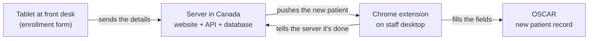
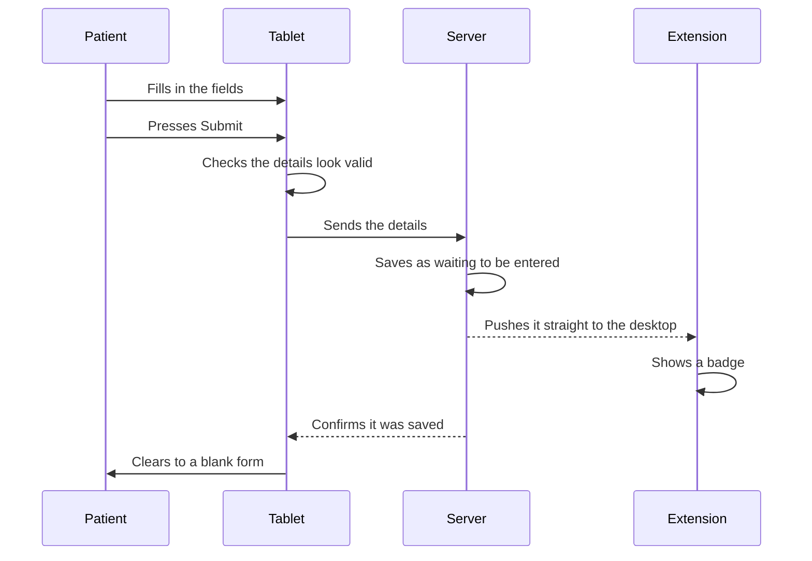
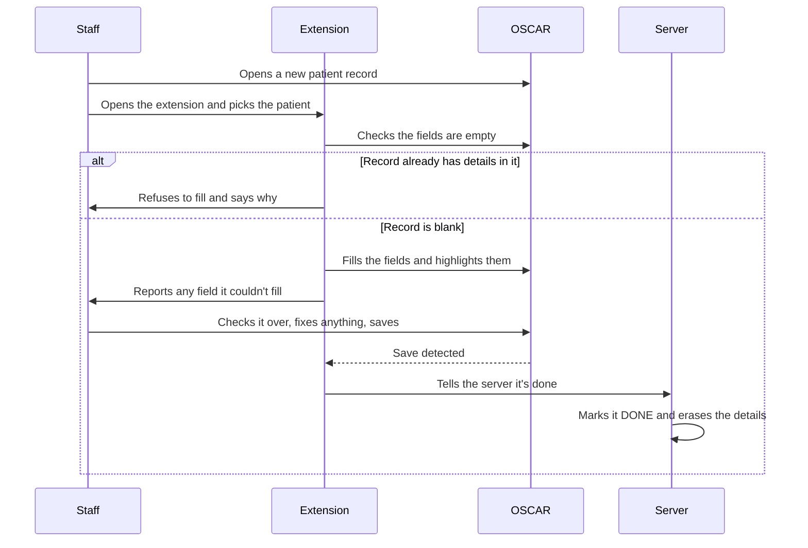

# asmart-autofill — Design

## Contents

- [Overview](#overview)
- [Tech Stack](#tech-stack)
- [Functional Requirements](#functional-requirements)
- [Non-Functional Requirements](#non-functional-requirements)
- [Diagrams](#diagrams)
- [API Design](#api-design)
- [Data Model](#data-model)
- [Trade-offs](#trade-offs)
- [Pricing](#pricing)
- [Future Considerations](#future-considerations)

## Overview

Patients sees multiple columns to be filled out for registration which is confusing to them. After that, the staff verifies it and adds to the EMR demography.

This replaces that with a form on a tablet at the front desk. The patient fills in a simplified form (13 fields) and submits. The details show up in a Chrome extension on the staff member's computer. The staff member opens a new patient record in EMR, clicks once to fill it in, checks it over, and saves.

**Goals**

- Give patients a simple form to fill in themselves.
- Cut the typing staff have to do, so registration is faster and has fewer mistakes.

**Not in v1**

- Returning patients — this is for new registrations only.
- Any EMR other than OSCAR.

**Who it's for:** clinics. They sign up, and their front desk staff use it daily.

## Tech Stack

| Part | Choice |
|---|---|
| Patient form, website, dashboard | React + TypeScript |
| API | Node + TypeScript |
| Database | Postgres, on the same server |
| Sign-in | Supabase Auth, hosted — email/password and Google |
| Extension | TypeScript, Manifest V3 |
| Push | Server-Sent Events |
| Hosting | OVH VPS, (Canada - East - Beauharnois) |
| Containers | Docker Compose |
| In front/web server | Caddy |


## Functional Requirements

### The fields collected

- First name
- last name
- preferred name
- address
- city
- province
- postal
- phone number
- email
- date of birth
- health insurance number
- health insurance version
- HC type.

### Clinic setup

1. A clinic signs up on the website, with an email address and password or with Google.
2. During signup they pick their EMR. OSCAR is the only working option; Custom is listed but shows "coming soon".
3. The dashboard shows their clinic name, registered email, which EMR they're on, the link to open on their tablet, and which devices are linked (desktop and tablet). They can change their password here, unless they signed up with Google.
4. All settings live on the website. The extension has no settings of its own — it reads whatever the clinic set up.

### Patient filling in the form

5. The patient opens the clinic's link on the tablet and fills in the fields.
6. The form checks the details look valid before it will submit.
7. On submit, the details are sent to the server and saved as waiting to be entered.
8. The tablet clears itself and shows a blank form for the next patient.
9. Pressing submit twice doesn't create two entries.

### Staff entering it into OSCAR

10. The staff member signs into the extension with the same clinic login.
11. The extension lists the patients waiting to be entered, newest first.
12. The staff member opens a new patient record in OSCAR and picks the patient from the list.
13. Clicking fill puts the details into the OSCAR fields and highlights what it filled.
14. If the record already has details in it, it refuses to fill and says so.
15. If any field couldn't be filled, it says which ones rather than failing quietly.
16. The staff member checks everything, corrects anything wrong directly in OSCAR, and saves.

### After it's entered

17. When the staff member saves in OSCAR, the patient's details are deleted from the server.
18. Anything not entered within 2 hours is cleaned up automatically and its details erased.

## Non-Functional Requirements

| What | Target |
|---|---|
| Clinics signed up | 100 |
| Clinics using it at the same time | 10–15 |
| Registrations per clinic per day | 40–50 |
| Registrations at the same time (concurrent) | 15–25 |
| Submissions per day, all clinics | ~4,000–5,000 |
| Writes per second | Under 1 |
| Any API request | Under 200ms |
| Patient submits → shows in extension | Under 200ms |
| Open push connections at once | 10–15 |


### Push, not polling

When a patient submits, the server saves the record and immediately pushes it to the clinic's desktop. The connection is held open by the extension's code running inside the OSCAR tab, because Chrome shuts an extension's background down after about 30 seconds idle and it can't hold a connection there.

If that connection drops it reconnects on its own. If it can't, the extension falls back to checking every few seconds, so a patient is never stuck waiting to appear.

## Diagrams

### The whole thing

Four parts. The tablet and the staff desktop never talk to each other directly — everything
goes through the server.



### A patient submits

From pressing Submit to the badge showing up on the staff member's extension. The whole
path is under 200ms.



### Staff enters it into OSCAR

From picking a patient to the details being erased from the server.



## API Design

Both the website and the extension use the same API and the same login.

### Signing in

Sign-in is handled by Supabase Auth, with email and password or Google. The API never sees
a password — it receives the token Supabase issued and checks it.

| Endpoint | What it does |
|---|---|
| `POST /api/signup` | After Supabase creates the account, this creates the clinic row — clinic name, EMR — and stores the Supabase user id against it. |
| `POST /api/login` | Takes the Supabase token, returns the clinic's details, and registers the device. |
| `POST /api/logout` | Logout from that device. |

The extension doesn't sign in by itself. Clicking sign in opens the website, staff sign in
there, and the token comes back to the extension — one sign-in flow instead of two, and
Google's flow only has to work in one place.

Signing in from the extension also registers that desktop as a linked device, so it shows up in the dashboard alongside the tablet.

```
POST /api/login
{ "token": "<supabase token>", "device_id": "b71c", "kind": "desktop" }

200 OK
{ "clinic_name": "Bloor Medical", "emr": "oscar" }
```

### The clinic's dashboard

| Endpoint | What it does |
|---|---|
| `GET /api/dashboard` | Clinic name, email, EMR, the tablet link, and the list of linked devices. |
| `POST /api/change_password` | Changes the password. Passes through to Supabase Auth. Not shown for Google accounts. |
| `POST /api/link_device` | Creates a fresh tablet link. Used at setup, or to replace a revoked one. |
| `DELETE /api/devices/{device_id}` | Unlinks a device. If it's the tablet, that link stops working immediately. |

Tablet links don't expire. If an iPad is lost, the clinic unlinks it from here and creates a new link..

### Patient submissions

| Endpoint | What it does |
|---|---|
| `GET /api/submissions` | The list of patients waiting. Names and times only. |
| `GET /api/submissions/{submission_id}` | The full details for one patient, for filling in. |
| `POST /api/submissions/{submission_id}/filled` | Staff saved it in OSCAR. Marks it DONE and erases the details. |
| `GET /api/submission_live` | The connection held open in the OSCAR tab. New patients are pushed down it. |


```
GET /api/submissions

200 OK
[ { "id": "a3f9", "name": "Jane Doe", "submitted_at": "2026-08-13T14:12:04Z" } ]
```

```
GET /api/submissions/a3f9

200 OK
{
  "id": "a3f9",
  "first_name": "Jane", "last_name": "Doe", "preferred_name": "Janie",
  "address": "12 King St W", "city": "Toronto",
  "province": "ON", "postal_code": "M5H 1A1",
  "phone": "4165551234", "email": "jane@example.com",
  "date_of_birth": "1985-04-17",
  "health_insurance_number": "1234567890",
  "health_insurance_version": "AB",
  "hc_type": "ON"
}
```

### The tablet

| Endpoint | What it does |
|---|---|
| `GET /api/submission_form` | Serves the enrollment form. Opened using the clinic's tablet link. |
| `POST /api/submissions` | The patient's submitted details. |

The details are sent in the request body, never in the address bar. Submissions are rate limited so a leaked link can't be used to flood a clinic's list with junk.

### Statuses

| Status | Means | Patient details kept? |
|---|---|---|
| `PENDING` | Submitted, not yet entered into OSCAR | Yes |
| `DONE` | Entered into OSCAR and saved | No — erased |
| `DELETED` | Nobody entered it and the cleanup ran | No — erased |

Rows are never thrown away. Once a form is DONE or DELETED, the patient's details are erased and the row keeps only its timings:

```
id: a3f9   clinic: Bloor Medical   status: DONE
submitted: 2:12pm   entered: 2:14pm
```

That leaves a permanent record of how many patients a clinic registered and when, with no patient data in it.

### Responses

| Code | When |
|---|---|
| `200` / `201` | Success. |
| `400` | Details failed validation. |
| `401` | Wrong password, or an expired or missing token. |
| `403` | Trying to reach another clinic's data. |
| `404` | No such submission or device. |
| `409` | That submission was already entered or cleaned up. |
| `429` | Too many submissions too quickly. |

## Data Model

One Postgres database on the same server as everything else. Three tables. Whether a device is allowed is decided by whether its row in `devices` still exists.

### clinics

One row per clinic.

| Column | Type | Notes |
|---|---|---|
| `id` | uuid | Primary key. |
| `name` | text | Clinic name, shown in the dashboard. |
| `email` | text | Unique. Shown in the dashboard. |
| `auth_user_id` | text | The user id from Supabase Auth. How a login maps to a clinic. |
| `emr` | text | `oscar` for now. Chosen at signup. |
| `created_at` | timestamptz | |

### devices

Every linked desktop and tablet.

| Column | Type | Notes |
|---|---|---|
| `id` | uuid | Primary key. |
| `clinic_id` | uuid | The clinic it belongs to. |
| `kind` | text | `desktop` or `tablet`. |
| `device_label` | text | e.g. "Front desk iPad". |
| `token_hash` | text | For tablets, the hash of the secret in their link. |
| `linked_at` | timestamptz | |
| `last_seen_at` | timestamptz | Shown in the dashboard. |

Only the hash of a tablet's secret is stored, so a copy of the database doesn't hand over working tablet links. Unlinking deletes the row and the link stops working immediately.

Desktops get a row when someone signs into the extension there. The extension generates its own device id once and keeps it, so signing out and back in reuses the same row rather than adding another "Front desk PC" to the list every time.

Every request from the extension carries its device id. If the row is gone, the request is refused — that's what makes unlinking take effect immediately.

### submissions

| Column | Type | Notes |
|---|---|---|
| `id` | uuid | Primary key. |
| `clinic_id` | uuid | Every lookup is filtered by this. |
| `status` | text | `PENDING`, `DONE`, or `DELETED`. |
| `details` | jsonb | The patient's details. Emptied once entered. |
| `submitted_at` | timestamptz | When the patient pressed Submit. |
| `entered_at` | timestamptz | When staff saved it in OSCAR. |

The details are kept as JSON because nothing ever searches inside them — a row is written
whole and read whole:

```json
{
  "first_name": "Jane", "last_name": "Doe", "preferred_name": "Janie",
  "address": "12 King St W", "city": "Toronto",
  "province": "ON", "postal_code": "M5H 1A1",
  "phone": "4165551234", "email": "jane@example.com",
  "date_of_birth": "1985-04-17",
  "health_insurance_number": "1234567890",
  "health_insurance_version": "AB",
  "hc_type": "ON"
}
```

When a submission becomes `DONE` or `DELETED`, `details` is emptied. The row keeps its id, clinic, status, and timings forever.

### Indexes

| Table | Index | For |
|---|---|---|
| clinics | `email` unique | Signing in. |
| devices | `clinic_id` | Listing devices in the dashboard. |
| submissions | `(clinic_id, status)` | The waiting list. |
| submissions | `(status, submitted_at)` | The cleanup. |


### The OSCAR field mapping is not in the database

Which OSCAR box each field goes into lives in a JSON file on the server, which the extension downloads when it signs in and keeps a copy of:

```json
{
  "emr": "oscar",
  "version": 1,
  "fields": {
    "first_name": "#firstName",
    "last_name":  "#lastName",
    "address":    "#address",
    "city":       "#city",
    "postal":     "#postal"
  },
  "save_button": "form[name=addDemographic]"
}
```

It's the same for every OSCAR clinic, so it doesn't belong in the database.
Keeping it on the server means a broken mapping is fixed in minutes instead of waiting days for a Chrome
Web Store review, and adding another EMR later is another file rather than a code change.

### Backups

Backed up nightly: clinics, devices, and the submissions rows **without the details column**. Restoring gives back every clinic account, every linked device, and the full history of how many patients were registered and when.

Patient details are never backed up. They live about 90 seconds and are the one thing here worth protecting, so keeping copies of them would undo the rest of this design.

## Trade-offs

### 1. Everything on one server

**Chosen:** one VPS running the website, the API, and Postgres together.

The alternative is a managed database and managed hosting, which costs more and means two things to configure instead of one. 

**When this changes:** at around 10,000 clinics, Postgres moves to its own server and the VPS keeps the website and API.

### 2. Relational database rather than a non-relational database

**Chosen:** Relational database (Postgres)

- ACID property
- Deleting a clinic automatically removes its devices and submissions.
- Two signups with the same email can't both succeed.
- Marking a submission entered and erasing its details happen together or not at all.

Postgres stores JSON fine, so the patient details sit in a JSON column exactly as they would in a document database. It isn't a choice between the two — one thing does both.


### 3. Pushing rather than checking every few seconds

**Chosen:** the server pushes a new patient to the desktop the moment they submit.

Checking every few seconds is simpler — around 30 lines with nothing to go wrong — but it means a patient can sit unnoticed for a few seconds. Pushing is more to build: the connection can drop and has to reconnect on its own.

The reason for pushing: staff should open the extension and find the patient already there, never wait for it to show up. If the connection drops, the extension falls back to checking every few seconds so nothing is ever missed.

### 4. The connection is held in the OSCAR tab

**Chosen:** the extension's code inside the OSCAR tab holds the open connection.

Not a preference — Chrome shuts an extension's background down after about 30 seconds idle, so it can't hold a connection there. An open tab isn't shut down, and staff have OSCAR open all day anyway.

The code in that tab belongs to the extension, not to OSCAR. Nothing is written into OSCAR until staff clicks fill.

**The one gap:** if Chrome discards the tab to free memory, the connection goes with it. It reconnects when the tab wakes up.

### 5. Details are erased once entered

**Chosen:** when staff saves in OSCAR, the patient's details are erased and the row keeps only its timings.

Keeping them would mean health card numbers sitting in the database indefinitely for no reason — the details are already in OSCAR, which is where they belong. Erasing them means the database holds a few dozen patient records at any moment instead of years' worth.

The timings stay, so a clinic can still see how many patients they registered and when.

### 6. The OSCAR mapping lives on the server

**Chosen:** a JSON file on the server, downloaded by the extension when it signs in.

If it were built into the extension, fixing a broken mapping would mean publishing an update and waiting days for Chrome to review it, with every clinic broken in the meantime. On the server it's fixed in minutes.

The cost is about 20 extra lines to download it and keep a copy for when the download fails, and the risk that a bad file breaks every clinic at once — which is also fixed in minutes. The file carries a version number so it's clear which one a clinic is running.

## Pricing

Figures are estimates in Canadian dollars and should be checked against current OVH pricing
before committing.

### Running it at 100 clinics

| What | Cost per month |
|---|---|
| OVH VPS, entry tier | ~$8 |
| Backup storage | ~$1 |
| **Total** | **~$9/month** |

One-off: a domain name at roughly $20 a year, and a one-time $7 fee to publish on the Chrome Web Store.

## Future Considerations

### 1. Custom mapping

The enrollment form stays exactly as it is. What changes is that the clinic can say where each field should land in their own EMR, instead of waiting for a mapping to be written for them.
This is the "Custom" option shown at signup. It's what makes the product work with an EMR that hasn't been seen before, without a code change or a release.

### 2. Scale 10,000 users/clinics

Postgres moves off the VPS onto a dedicated database server, likely Supabase. The website and API stay in VPS.
