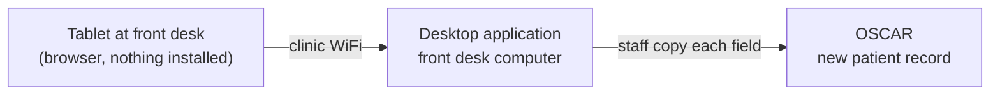
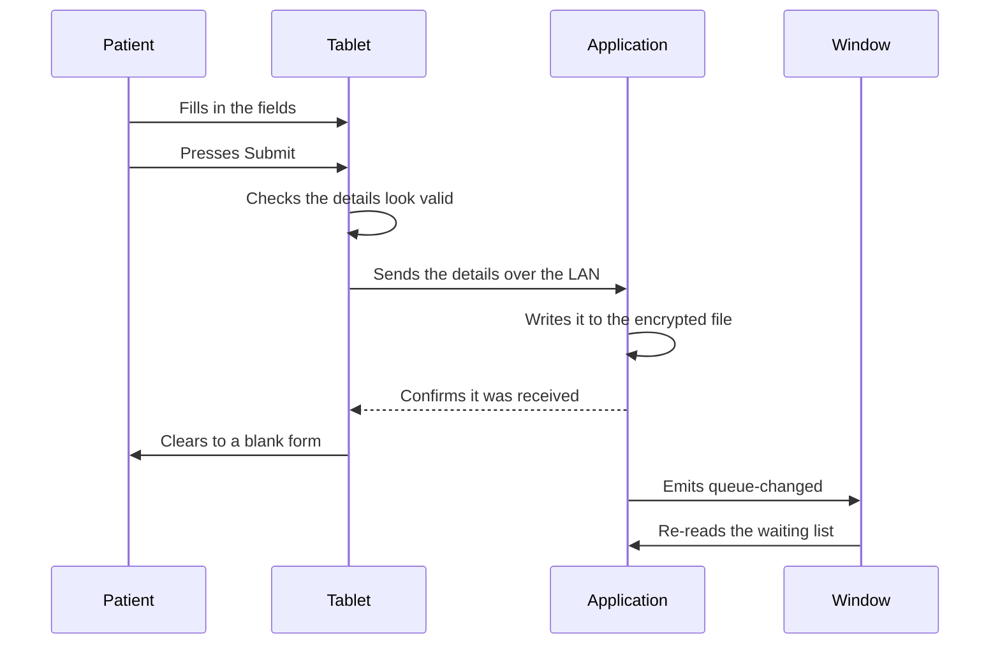
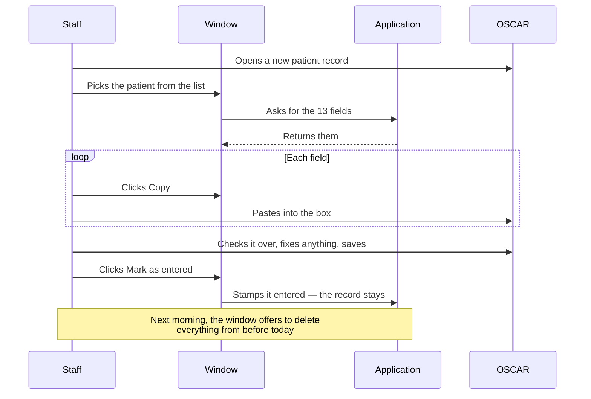

# asmart-autofill — Design

## Contents

- [Overview](#overview)
- [Tech Stack](#tech-stack)
- [Functional Requirements](#functional-requirements)
- [Non-Functional Requirements](#non-functional-requirements)
- [Diagrams](#diagrams)
- [Local API](#local-api)
- [Data](#data)
- [Observability](#observability)
- [Distribution](#distribution)
- [Trade-offs](#trade-offs)
- [Pricing](#pricing)
- [Future Considerations](#future-considerations)

## Overview

Patients see multiple columns to be filled out for registration, which is confusing to them. After that, the staff verifies it and adds it to the EMR demographic.

This replaces that with a form on a tablet at the front desk. The patient fills in a simplified form (13 fields) and submits. The details land on the front desk computer, where the staff member opens the waiting patient, copies each field into a new OSCAR record, and saves.

**Goals**

- Give patients a simple form to fill in themselves.
- Cut the typing staff have to do, so registration is faster and has fewer mistakes.

**Not in v1**

- Any EMR other than OSCAR.

**Who it's for:** clinics. They install it on the front desk computer and use it daily.

### No server

The tablet and the computer are ten metres apart on the same WiFi. Patient details never need to leave the building, so nothing here goes to the internet.

A desktop application on the front desk computer is the whole product and the source of truth. It serves the form to the tablet, receives the submission, holds it, and shows it to staff a field at a time. There is no cloud service, no database, and no account to sign into. What it holds is written to one encrypted file on that same computer and stays there until a staff member deletes it.

The application exists because a browser tab cannot accept an incoming connection — it can only make outgoing ones. For the tablet to send anything to the computer, something on that computer has to be listening at an address. That is the application's job.

The only things the application sends to the internet are the update check and error reporting.

## Tech Stack

| Part | Choice |
|---|---|
| Desktop application | Tauri |
| Backend / Application core | Rust — the HTTP server, the queue, and the encrypted record file |
| Frontend / Patient form, desktop window | React + TypeScript |
| Storage | One DPAPI-encrypted file on the front desk computer |
| Transport | HTTP over the clinic LAN |
| Updates | Tauri's updater |

## Functional Requirements

### The fields collected

- First name
- Last name
- Preferred name
- Address
- City
- Province
- Postal code
- Phone number
- Email
- Date of birth
- Health insurance number
- Health insurance version
- HC type

### Setting up

1. The clinic installs the application on the front desk computer. Staff open it at the start of the day like any other program.
2. On start, it picks up the computer's address on the clinic WiFi and listens there.
3. The window shows a QR code containing that address and a pairing token, and the same link as text with a copy button. Staff scan it once on the tablet, which opens the form.
4. If the computer's address changes — a reboot, a new lease — the QR shows the new one. Staff rescan. Nothing else is configured.
5. Closing the window stops the application. Nothing is configured to run without a window open.

### Patient filling in the form

6. The patient opens the form on the tablet and fills in the fields.
7. The form checks the details look valid before it will submit.
8. On submit, the details are sent to the application and held as waiting to be entered.
9. The tablet clears itself and shows a blank form for the next patient.
10. Pressing submit twice doesn't create two entries.
11. If the application isn't running or the computer is asleep, the tablet says the front desk isn't reachable rather than failing silently.

### Staff entering it into OSCAR

12. The window shows how many patients are waiting and lists them, newest first.
13. Clicking one opens every field the patient filled in, in the order they filled them.
14. Each field has a copy button that puts just that value on the clipboard and confirms it did.
15. Province and health-card province copy the two-letter code, since that is what OSCAR's dropdown takes; the full name is shown beside it to read.
16. A field the patient left blank shows as blank, with nothing to copy.
17. The staff member pastes each value into a new OSCAR record, checks it over, and saves.

### After it's entered

18. The staff member clicks **Mark as entered**, which stamps the record with the time and moves it out of the waiting list into a list of records already in the EMR. It is not deleted.
19. Nothing is ever deleted by the clock. A record leaves the computer when a staff member says so, and not before.
20. Every record survives closing the application and restarting the computer.

### Deleting

21. Any record can be deleted from its own view at any time, entered or not. It takes one confirm, because it cannot be undone.
22. The first time each day that the window sees a record submitted before today, it asks: **Time to delete records from yesterday**, with **Delete** and **Cancel**. Each day, not each launch — a front desk that leaves the window open all week is still asked every morning.
23. "Yesterday" is the calendar day on the wall, not 24 hours elapsed — that is the rule a staff member can check against a clock without doing arithmetic.
24. The prompt says how many of those records were never marked as entered, and takes a second confirm before deleting any of them. Deleting a patient nobody copied into the EMR is the one way this prompt can lose someone.
25. **Cancel** deletes nothing and is not asked again that day.
26. Deleting removes the record from the file for good. One line goes into the log — the id and the time, never a field.
27. A deletion that cannot be written to disk fails in front of the staff member rather than quietly. The records stay where they are and the window says so, because a delete reported as done and then undone by a restart is worse than one that visibly did not happen.

## Non-Functional Requirements

| What | Target |
|---|---|
| Tablets per clinic | 1 |
| Registrations per clinic per day | 40–50 |
| Submissions waiting at once | 1 |
| Patient submits → appears in the window | Under 1 second |
| Any local request | Under 50ms |

Everything here happens on one machine over a local network, so the numbers are not a constraint on the design. A hundred clinics is a hundred independent copies that never meet.

### Getting new submissions to the window

The window is the application's own frontend, so the queue tells it directly: every add, removal, and expiry emits an event the window listens for and re-reads the list on. Nothing polls.

## Diagrams

### The whole thing

Two parts, both inside the clinic, plus the EMR already on the desk.



### A patient submits



### Staff enters it into OSCAR



## Local API

Everything the application serves, which is now only what the tablet needs. It listens on one port on the LAN address.

The window is the application's own frontend and does not go through HTTP at all — it calls into the core directly (`list_waiting`, `get_submission`, `mark_entered`, `delete_submissions`, `get_pairing_info`) and is told about changes by event. That is why the waiting list is not reachable over the network by anything, which is a stronger position than v1's origin check ever was.

### For the tablet

| Endpoint | What it does |
|---|---|
| `GET /` | The form. Requires the pairing token from the QR code. |
| `POST /api/submissions` | The patient's submitted details. |
| `GET /api/health` | Lets the tablet tell "front desk is asleep" from "form is broken". |

The details are sent in the request body, never in the address bar. Requests without a valid pairing token are refused, so a stranger who guesses the address gets nothing.

```
POST /api/submissions
{
  "first_name": "Jane", "last_name": "Doe", "preferred_name": "Janie",
  "address": "12 King St W", "city": "Toronto",
  "province": "ON", "postal_code": "M5H 1A1",
  "phone": "4165551234", "email": "jane@example.com",
  "date_of_birth": "1985-04-17",
  "health_insurance_number": "1234567890",
  "health_insurance_version": "AB",
  "hc_type": "ON"
}

201 Created
{ "id": "a3f9" }
```

### Responses

| Code | When |
|---|---|
| `200` / `201` | Success. |
| `400` | Details failed validation. |
| `401` | Missing or wrong pairing token. |
| `429` | Too many submissions too quickly. |

## Data

One file, `%LOCALAPPDATA%\com.asmart.autofill\queue.dat`, holding every record the clinic has not deleted. Local, not roaming: Windows does not sync that folder to OneDrive or to another machine the staff account signs into.

| Field | Notes |
|---|---|
| `id` | Generated on receipt. |
| `details` | The 13 fields. |
| `submitted_at` | When the patient pressed Submit. |
| `entered_at` | When staff marked it entered, or absent. |
| `idempotency_key` | The tablet's key for the submission, so a retry across a restart is still one patient. |

A record leaves the file only when a staff member deletes it. Nothing expires.

**Encrypted with DPAPI.** The file is sealed with `CryptProtectData` under the Windows account the application runs as, with an application-specific entropy value mixed into the key. Copied to another computer, or opened under another Windows account, it does not decrypt. There is no key to store, back up, or lose — which is the whole reason for choosing DPAPI over a passphrase the clinic would write on a sticky note.

What it does not protect against: anything already running as that staff account, which can ask DPAPI to unseal the file exactly as the application does. This raises the bar from "any file copy is a breach" to "you must already be that user on that machine". It is not a substitute for the clinic securing the front desk login.

**Written atomically.** Each change is written to a temporary file, flushed to the drive, and renamed over the real one. A crash partway through a direct write would leave bytes that decrypt to nothing, losing every record rather than the one being added. The flush is the half that is easy to skip: the rename swaps the names atomically but does not push the bytes out of the cache, so without it a power cut can leave the real name pointing at a short file — which is the same loss, arrived at by a longer route.

**Deletion is written before it is believed.** The new contents reach the file first; only then does the record leave memory, and only then does the window hear that it worked. If that write fails the record is still held, and the staff member is told. Additions take the opposite trade — a failed write is logged and the patient is kept in memory — because turning someone away at the desk over a disk fault helps nobody, while a deletion that reverses itself overnight is exactly the failure the whole feature exists to prevent.

**A file that will not read is a startup failure**, not an empty queue. Carrying on empty would have the first write of the day replace patients nobody has entered yet, so the application shows the error dialog and stops instead. The dialog names the file and says to move it aside, because DPAPI stops decrypting for good once an administrator resets the account password or rebuilds the profile — and without that sentence the operator is left with an application that will not start and no way to find out why.

The clipboard is the exception, and it is worth being honest about it. Copying a field puts that value — a health card number included — on the Windows clipboard, which nothing in this application controls or clears. With Clipboard History (Win+V) on, the last twenty-five values persist; with Cloud Clipboard on, they sync to whatever Microsoft account is signed in, which is the one path by which a patient's details can leave the clinic. Both are off by default on a fresh Windows install and both are Group Policy settings, so the deployment note is to leave them off rather than to work around them in the application.

## Observability

A daily rolling file at `%LOCALAPPDATA%\com.asmart.autofill\logs\app.log`, `info` by default, `RUST_LOG` to raise it.

One line per event, not per request. A clinic registers forty or fifty patients a day, so a log of events reads in a minute where a log of requests would not.

| Message | When |
|---|---|
| `started` | Ready to serve. Carries `address` and `port` — the pair the QR encodes. |
| `startup failed` | Setup did not finish. Carries the error and is followed by a dialog. |
| `form served` | The form went to a tablet. Carries the tablet's `ip`. |
| `form refused` | `GET /` arrived without a usable token. Carries `ip` and whether the token was missing or wrong. |
| `store loaded` | The record file was read at startup. Carries how many records it held. |
| `store write failed` | An addition could not be written to disk. Carries the error; the record is still in memory. |
| `delete not written; the records are still held` | A deletion could not be written to disk. Carries the error; nothing was removed and the window was told. |
| `{id} received` | A submission was queued. |
| `submission failed` | A submission was rejected. Carries the reason. |
| `{id} entered` | Staff marked the submission entered in the window. |
| `{id} deleted` | Staff deleted the record. The file no longer holds it. |

`{id} received`, `{id} entered` and `{id} deleted` are the three that matter: one day's log read top to bottom shows which patients made it into the EMR, and when each record left the computer. Deletion being manual is a claim the clinic will have to make about its own handling of patient data; this log line is what makes it a claim they can show rather than one they assert.

Where a function returns an error, its own message is logged verbatim rather than a sentence written here. Where nothing returns an error — a token that fails a byte compare, a counter passing the rate limit — the observed values are logged instead (`token=missing`, `count=13 limit=10`).

**What is never logged:** any field the patient typed. Records are meant to be deleted daily; a log file that never expires would keep a copy of what was deleted, which would undo the deletion. Rejections name the field, never its value.

**What cannot be logged:** a scan that never reaches the machine. A tablet on the wrong network or a blocked firewall port produces no packet, so there is nothing to write — the failure looks identical to nobody scanning. That case is addressed in the window, not here.

## Distribution

An unsigned NSIS installer, carried to the front desk computer once. Windows SmartScreen warns on the first run; an EV certificate would remove that and is priced below, not bought.

After that the application updates itself. On launch it reads a `latest.json` from the project's GitHub Releases, compares the version against its own, and offers the update in a strip along the bottom of the window. Nothing installs unprompted — an application that restarts on its own mid-registration loses the patient standing at the desk.

The update is signed with a key that never leaves the developer's machine, and the application refuses a bundle whose signature does not match. That is what stops a clinic's network, or whoever controls the download, substituting a different program. The signing key is therefore the one secret in this project that matters: losing it means no existing install can ever update again.

The feed is a plain public URL with no credentials attached, which is why the repository holding the releases has to be public. The steps are in [releasing.md](releasing.md).

## Trade-offs

### 1. A desktop application rather than a cloud service

Patient details never leave the clinic, which removes the data residency question, the breach surface, and the processor agreements that come with holding health data on someone else's machine. 

**The cost:** is that you have software installed on a hundred different Windows machines instead of one server you control, and you are blind to what happens on them beyond what error reporting tells you.

### 2. Kept on disk until staff delete it, rather than expiring on a timer

**Chosen:** every record is written to an encrypted file and stays there until a staff member deletes it. The window offers to clear yesterday's once each day.

Earlier versions held everything in memory and swept anything older than two hours. That was the safest possible position on retention — a health card number could not outlive the visit because there was nowhere for it to live — but it made the application lose patients for reasons the front desk could not control. A reboot during a busy morning, a crash, a power cut, or simply nobody getting to the queue within two hours, and the patient standing at the desk had to fill the form again. It also meant staff had no way to check yesterday's work.

**The cost, stated plainly:** health card numbers, names and dates of birth now sit on a clinic PC, and how long they sit there is a matter of staff habit rather than a timer. If nobody ever presses Delete, nothing is ever deleted. That is a real change in what the clinic is holding, and it is why deletion is prompted daily, why the prompt names records nobody entered before destroying them, and why every deletion is logged.

DPAPI is what keeps the cost bounded: the file is worthless off that machine and under any other account. It does not defend against whoever is already logged in at the front desk, and nothing in this design pretends otherwise — see [Data](#data).

**When this changes:** if a clinic asks for a retention policy stronger than a daily prompt, the answer is a configurable maximum age that deletes without asking, with the prompt kept for anything younger.

### 3. HTTP for now

**Chosen:** the tablet talks to the application unencrypted.

WiFi already encrypts traffic between a device and the router, and this is a closed clinic network. The residual risk is a device already on that network reading a submission in flight. Nothing is built for this in v1; see Future Considerations.

**When this changes:** before selling to any clinic that asks how the data is protected in transit, which will happen.

### 4. Rust in the core, React everywhere else

**Chosen:** Tauri, with the HTTP server and queue in Rust and everything visible in React.

The application has to accept an incoming connection, and no webview can. Something native has to hold the port, and in Tauri that something is Rust — there is no alternative inside the framework.

The alternative was bundling a Node runtime as a sidecar to keep the whole project in TypeScript. That costs about 50MB of install, a second process to supervise, and gives up the reason to use Tauri at all.

**Why the cost is acceptable:** the Rust is one file that stops changing once the routes work. The parts that change often — the form and the desktop window — are both TypeScript.

### 5. QR code for discovery

**Chosen:** the application shows a QR with its current address, staff scan it on the tablet.

The alternatives are a fixed address on the computer, which makes the clinic's network someone's problem, or announcing itself over the network, which some networks block. A QR works everywhere and needs nobody to understand what an IP address is. The cost is a rescan on the rare occasions the address changes.

### 6. Staff copy each field rather than an extension filling them

**Chosen:** the window hands staff each value on a click; nothing types into OSCAR.

v1 shipped a Chrome extension that read the queue over localhost and filled the OSCAR form. It is deprecated. What it bought was thirteen fields typed by a machine instead of a person. What it cost was a second artifact on a separate release cycle — a Web Store review of several days sat between a broken selector and a working clinic, which is why the field mapping had to live on the application side in the first place. It also meant the waiting list had to be readable over HTTP by something that could not prove who it was, which was the weakest point in the whole design.

Removing it deletes the mapping file, the four localhost routes, the origin check, the Web Store listing, and the entire class of failure where OSCAR changes a selector and the fill silently stops working.

**The cost:** staff paste thirteen times per patient instead of clicking once, and each paste goes through the Windows clipboard — see Data. That is real, and it is the reason this trade-off is written down rather than assumed. It is still less work than reading a paper form and typing it, which is what the product replaces, and it never fails in a way that needs a release to fix.

**When this changes:** if pasting turns out to be the slow part of registration in practice, the answer is more likely a one-click paste driven from the desktop side — something that types into the focused window — than a return to a browser extension.

## Pricing

| What | Cost |
|---|---|
| Servers | $0 |
| Database | $0 |
| EV code signing certificate | ~$300–500/year |
| Domain, for the update feed and site | ~$20/year |
| Static hosting for the update feed | ~$0 |

## Future Considerations

### 1. Encrypted transfer between tablet and desktop

The open item from v1. Three ways, in order of how much they cost to build:

- **HTTPS with a certificate the application generates itself.** Real encryption. The tablet shows a "connection is not private" warning that staff accept once during setup, because the certificate isn't from an authority the tablet recognises.
- **Encrypt the fields inside the form** using a key carried in the pairing QR. No warning on the tablet, about thirty lines using the browser's own crypto. Protects against a device snooping on the network, but not one actively tampering with it, since the form itself still arrives unencrypted.
- **A trusted certificate for a local address**, which is possible but involves owning a domain and renewing certificates for machines that may be offline.

The first is what comparable local-transfer tools do and is the likely answer.

### 2. Custom mapping

The form stays exactly as it is. What changes is that the clinic can say which of the 13 fields their EMR wants and what to call them, instead of reading a list written for OSCAR. This is what makes the product work with an EMR that hasn't been seen before, without a code change or a release. It is a labelling and ordering job now that nothing is being filled automatically — much less than the selector map v1 needed.

### 3. macOS

Windows first. macOS needs an Apple developer account, notarization, and its own testing pass.

Dropping the extension removed the one part of the application that read a file beside its own executable, which was the thing that would have broken on a macOS bundle. What is left is the updater, which needs a macOS target and its own signed artifacts in the release feed.

### 4. A native tablet app instead of the browser

**What this would replace:** the QR code, and the desktop having to work out its own address.

A machine does not have one IP address — it has one per network interface. A typical Windows PC carries loopback, the real WiFi adapter, several virtual copies of the WiFi card that Windows creates for hotspot and casting, and often a VPN adapter. Only one of those is reachable from a tablet on the clinic WiFi. Today the desktop picks it by scoring adapters (`net.rs`): not loopback, not a `169.254` placeholder, has a gateway, prefer wireless. That is the standard heuristic and it is right on an ordinary clinic PC, but it is still an inference — a VPN holding the default route is the case most likely to defeat it.

**How local-transfer applications normally avoid the question.** LocalSend, KDE Connect, Syncthing and similar tools do not guess. One side broadcasts a small packet to the local network — "I am here, this is my name and port" — and the other side hears it. The packet arrives carrying its own return address, and that address is proven reachable by the fact that the packet arrived at all. No scoring, no heuristic. mDNS/Bonjour is the same idea with a name attached, which is how printers and Chromecast are found.

**Why v1 cannot use it.** Discovery needs software on both ends. The tablet runs a plain browser, and a browser cannot listen for broadcasts — it can only open a URL it has been handed. So the address must be decided before anything reaches the tablet, with no help from the tablet. This is a direct consequence of the browser-based design, not an oversight.

**What a native app changes.** With an app on the tablet, the desktop stops advertising an address and starts announcing itself. The tablet finds it, and the address problem disappears rather than being solved. It also brings offline capture, a stored pairing instead of a bookmarked URL, and a real place to put encryption without the certificate warning described in item 1.

**What it costs.** An Android and an iOS build, two store accounts and two review processes, a release cycle that no longer moves at the speed of the desktop application, and a pairing flow that has to be designed rather than inherited from a URL. It also gives up the single largest advantage of the current design: a tablet needs nothing installed, so any device with a camera and a browser works, including a personal phone.

**When to revisit.** If address detection causes trouble on real installs, or if a clinic asks for offline capture. Until then the QR is the cheaper answer. A smaller step in the same direction is listing every candidate address in the window so staff can switch when the automatic choice is wrong — that covers the same failure without a mobile app.

### 5. Log retention by importance, not by age

**Where this stands today.** Logging rolls to a new file each day and keeps every one of them. Nothing prunes. A machine that has run for a year holds a year of files, the oldest still describing what happened on day one. The log now also records `{id} deleted`, which is the line a clinic would want to keep longest and the routine traffic around it that is worth dropping first.

**The obvious fix, and why it is not the one wanted.** `tracing-appender` takes a `max_log_files` cap: on each rotation the oldest file is deleted. One argument, no moving parts. But it discards by age alone, so a genuine startup failure from three weeks ago is thrown away at exactly the same moment as three weeks of routine "listening on 0.0.0.0" lines. The information worth keeping is the rarest, and an age cap is blind to that.

**The intended approach.** A scheduled cleanup that prunes by importance instead: drop the routine entries once they are past their useful window, keep errors, warnings, startup failures, and address changes for much longer. Recent days stay complete for debugging a complaint from last week; older days shrink to only the lines that would ever be read again.

**What it costs.** More machinery than a cap. Something has to run on a schedule, parse each line to classify it, and rewrite files that the running application may hold open — which is the part that needs care on Windows, where an open file cannot always be replaced. Deciding which levels survive is a policy that has to be written down, and getting it wrong deletes the evidence for a bug rather than the noise around it.

**Why it matters beyond disk space.** The volume is small — kilobytes a day. The reason to prune is that after B6 the log records that a submission arrived, and at what time. Even with no patient data in the line, keeping an indefinite record of clinic activity is a retention decision, and it should be a deliberate one.

**When to revisit.** Before the first real install, since an unpruned log starts accumulating from the moment the application ships. If the cleanup job is not ready by then, apply the age cap as a stopgap and replace it later — an imperfect prune is better than none.
